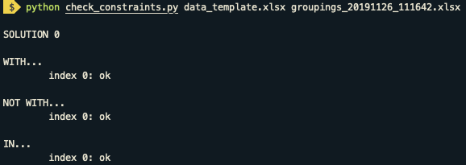

# Student Groups Optimization

Use linear programming to assign students to groups subject to constraints specifying:
- __INDIVIDUALS__
    - __with:__ students to assign to a group together
    - __not with:__ students to assign to different groups
    - __in:__ students to assign to a specific group
    - __not in:__ students not to assign to a specific group
- __CHARACTERISTICS__ _--> advanced, disruptive, extrovert, IEP, introvert, male/female_
    - __homogenous:__ groups to assign only students with a specified characteristic
    - __maximum:__ maximum number of students with specified characteristic per group

Review the optimal student groupings in tabular form.

<p align="center">
    
</p>

## Getting Started

### Download the repository

Click  `Clone or download`  and `Download ZIP`. Once the download is complete, unzip the file and drag it onto your desktop.

### Setup a virtual environment with Anaconda

The next step is to create a virtual environment on your computer. This environment will hold the Python version and packages necessary for student groups optimization. We can build the environment using the [Anaconda Distribution](https://www.anaconda.com/what-is-anaconda/), a popular Python data science platform for package management and deployment. If you already have Anaconda installed, move on to the next step. Otherwise, [download Anaconda here](https://www.anaconda.com/download/).

To confirm Anaconda is installed correctly, [open a terminal window](http://blog.teamtreehouse.com/introduction-to-the-mac-os-x-command-line) and run:

```
conda --version
```

You should see the installed version number, such as `conda 4.7.12`. If instead you see an error message, reference [verifying that conda is installed](https://docs.anaconda.com/anaconda/install/verify-install/) in the conda documentation.

With Anaconda correctly installed, navigate in the terminal to the `student-groups-optimization-master` directory using the command:

```
cd Desktop/student-groups-optimization-master/
```

#### Option 1: Create environment from environment.yml file

Once in the correct directory, you can use the `environment.yml` file to create a virtual environment on your computer using the command:

```
conda env create -f environment.yml
```

This will install the necessary packages and may take some time to finish. Once the process is complete, run:

```
conda info --env
```

to list the virtual environments available on your computer with the active environment identified with an asterisk (*). You should see the new student-groups environment on this list.

Activate the `student-groups` virtual environment by running the following command:

```
conda activate student-groups
```

Verify the `student-groups` environment was installed correctly using:

```
conda list
```

You should see a list of packages and package versions installed in your environment, including You should see a list of installed packages and package versions including `jupyter 1.0.0`, `openpyxl 3.0.1`, `pandas 0.25.2`, `pulp 1.6.8`, `python 3.7.5`, and `xlrd 1.2.0` . If instead you see an error message, reference [creating an environment from an environment.yml file](https://conda.io/docs/user-guide/tasks/manage-environments.html#creating-an-environment-from-an-environment-yml-file) in the conda documentation.

#### Option 2: Create an environment and install necessary packages

Once in the correct directory, you can create a `student-groups` virtual environment on your computer using the command:

```
conda create -n student-groups python=3.7.5 pandas=0.25.2 jupyter=1.0.0 xlrd=1.2.0 openpyxl=3.0.1
```

When prompted to proceed type `y` and hit `Enter`. This will install the correct version of Python along with the correct versions of the pandas, Jupyter, xlrd, and openpyxl packages into a newly created student-groups virtual environment. Note that each installation may take some time to finish.

Now activate the `student-groups` environment by running:

```
conda activate student-groups
```

You need to install one additional package called PuLP using conda-forge before you are ready to optimize student groups. Install the pulp package using the following command

```
conda install -c conda-forge pulp
```

When prompted to proceed type `y` and hit `Enter`.

Verify your `student-groups` environment is set up correctly using:

```
conda list
```

You should see a list of installed packages and package versions including `jupyter 1.0.0`, `openpyxl 3.0.1`, `pandas 0.25.2`, `pulp 1.6.8`, `python 3.7.5`, and `xlrd 1.2.0` . If instead you see an error message, reference [installing packages](https://docs.anaconda.com/anaconda/user-guide/tasks/install-packages/) in the conda documentation.

### *Alternative without Anaconda: Install necessary packages*

You will need `Python 3.5` or greater along with the `pandas`, `pulp`, `jupyter`, `xlrd`, and `openpyxl` packages to successfully run the student groups optimization program.

### Enter data using Google Sheets

You are now ready to enter your student, group, and constraint data using Google Sheets!

Go to your Google Drive and click `New > Google Sheets`. 

Go to `File > Open` and select the `Upload` tab. Click `Select a file from your device` and navigate to the `Desktop > student-groups-optimization-master > data` directory. Select the `data_template.xlsx` file and click `Open`.

#### Person Setup

Go to the `Person Setup` sheet. Delete example data and enter student names and characteristics in the specified columns.

<p align="center">
    
</p>    

- __name:__ enter student name
- __advanced:__ enter 1 for advanced student, 0 otherwise
- __disruptive:__ enter 1 for distruptive student, 0 otherwise
- __extrovert:__ enter 1 for extroverted student, 0 otherwise
- __iep:__ enter 1 for IEP student, 0 otherwise
- __introvert:__ enter 1 for introverted student, 0 otherwise
- __male:__ enter 1 for male student, 0 for female student

#### Grouping Setup

Go to the `Grouping Setup` sheet. Delete example data and enter grouping ID and size values in the specified columns.

<p align="center">
    
</p>      

- __group id:__ enter a unique name for each group
- __size:__ enter the maximum size for each group

#### Constraint - With

Go to the `Constraint - With` sheet to specify which (if any) students to assign to a group together.

<p align="center">
    
</p>    

- __name 1 - 6:__ enter student names in the same row to ensure assigned to a group together

#### Constraint - Not With

Go to the `Constraint - Not With` sheet to specify which (if any) students to assign to different groups.

<p align="center">
    
</p>

- __name 1 - 6:__ enter student names in the same row to ensure assigned to different groups

#### Constraint - In

Go to the `Constraint - In` sheet to specify which (if any) students to assign to a specific group.

<p align="center">
    
</p>    

- __name:__ enter student name
- __group id:__ enter specific group to assign to student 

#### Constraint - Not In

Go to the `Constraint - Not In` sheet to specify which (if any) students to not assign to a specific group.

<p align="center">
    
</p>    

- __name:__ enter student name
- __group id:__ enter specific group to not assign to student 

#### Constraint - Homogenous

Go to the `Constraint - Homogenous` sheet to specify which (if any) groups to assign only students with a specified characteristic.

<p align="center">
    
</p>   

- __group id:__ enter group to assign only students with specified characteristic and characteristic value
- __characteristic:__ specify characteristic
- __value:__ specify characteristic value

#### Constraint - Maximum

Go to the `Constraint - Maximum` sheet to specify the maximum number of students with specified characteristic to assign to each group.

<p align="center">
    
</p>    

- __maximum:__ enter the maximum number of students with specified characteristic per group
- __characteristic:__ specify characteristic
- __value:__ specify characteristic value

When you finish entering your student, group, and constraint data in Google Sheets, go to `File > Download > Microsoft Excel (.xlsx)`. Move the downloaded data file from your `Downloads` directory to the `Desktop > student-groups-optimization-master > data` directory.

You are now ready to optimize your student groups!

### Run the program in Jupyter Notebook

Go to the terminal window where you activated your `student-groups` environment and run:

```
jupyter notebook
```

A window should open in your web browser with what looks like your folder directory. If the window does not open automatically, copy/paste the URL from the terminal into your favorite web browser.

Navigate through the folder structure to the `student-groups-optimization-master` directory on your desktop. Open the `Student Groups Optimization.ipynb` file. Follow the instructions in the notebook and press `Shift + Enter` to run the code in each cell.

Congratulations! You are now a student group optimizing machine!

### _Alternative without Jupyter Notebook: Run the program in terminal window_

Go to the terminal window where you activated your `student-groups` environment and run a command of the form:

```
python run_program.py filename num_solutions [-v] [-s]
```

with positional arguments (order matters):
- __filename:__ filename for Excel spreadsheet with student, group, and constraint data as `your_filename_here.xlsx`
- __num_solutions:__ desired number of optimal solutions

and optional arguments:

- __-v:__ print solution(s) in terminal window
- __-s:__ save student groups to Excel spreadsheet

_Examples:_

- Run program using student, group, and constraint data in `data_template.xlsx`. Output 3 optimal student groupings. Print student groupings to terminal window and save solutions to Excel spreadsheet.

<p align="center">
    
</p>    

- Run program using student, group, and constraint data in `data_template.xlsx`. Output 2 optimal student groupings. Save solutions to Excel spreadsheet.

<p align="center">
    
</p>    

- Run program using student, group, and constraint data in `data_template.xlsx`. Output 1 optimal student grouping. Print student groupings to terminal window.

<p align="center">
    
</p>    

Congratulations! You are now a student group optimizing machine!

#### _Optional: Check constraints satisfied_ 

To double check that the student grouping solution(s) output by the program satisfy your specified constraints, run a command of the form:

```
python check_constraints.py data_filename groups_filename
```

with positional arguments (order matters):
- __data_filename:__ filename for Excel spreadsheet with student, group, and constraint data as `your_filename_here.xlsx`
- __groups_filename:__ filename for Excel spreadsheet with student groups as `your_filename_here.xlsx`

_Example:_

- Check that the student grouping solution(s) output by the program and saved in `groupings_20191126_111642.xlsx` satisfy the constraints specified in `data_template.xlsx`.

<p align="center">
    
</p>    

#### _Optional: Check uniqueness of multiple solutions_ 

With multiple solutions, to review the number of students who change groups from one solution to the next, run a command of the form:

```
python check_uniqueness.py data_filename groups_filename
```

with positional arguments (order matters):
- __data_filename:__ filename for Excel spreadsheet with student, group, and constraint data as `your_filename_here.xlsx`
- __groups_filename:__ filename for Excel spreadsheet with student groups as `your_filename_here.xlsx`

_Example:_

- Review the number of students who change groups from one solution to the next where the `groupings_20191126_111642.xlsx` file holds the solutions to compare and the `data_template.xlsx` file holds the student, group, and constraint data.

<p align="center">
    
</p>    

## Cleanup

### Student groups optimization notebook

When you finish using the `Student Groups Optimization.ipynb` notebook, go to `File > Save and Checkpoint` to save your progress and `File > Close and Halt` to close the notebook.

Exit the tab with the Jupyter folder directory in your web browser.

Go to the terminal window and press `Control + C` two times to shut down the notebook server.

### Student groups virtual environment

To deactivate the `student-groups` environment, run:

```
conda deactivate
```

If you want to remove the `student-groups` virtual environment from your computer (this is optional), use the command:

```
conda env remove --name student-groups
```

When you are finished, exit the terminal with:

```
exit
```

and close the terminal window.

Cleanup complete!
